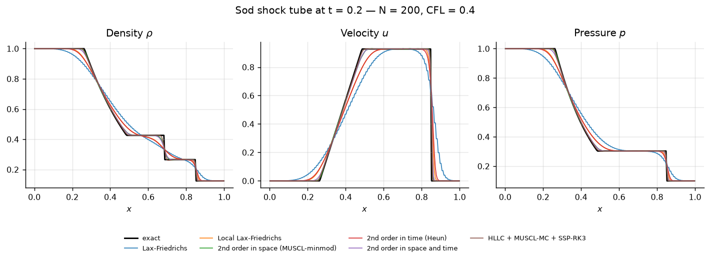
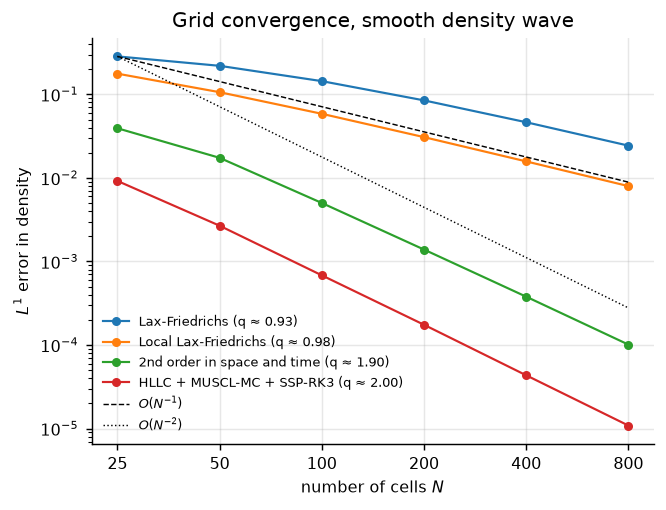
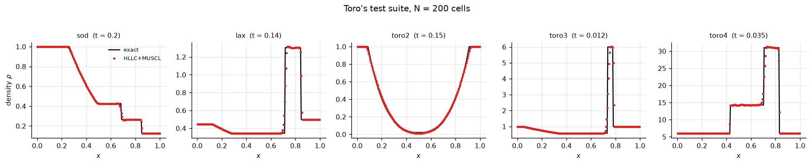

# The Finite Volume Method for the 1-D Euler Equations

[](https://github.com/tu-h-nguyn/The-Finite-Volume-Method-for-One-Dimensional-Euler-Equations/actions/workflows/ci.yml)
[](https://www.python.org/)
[](LICENSE)
[](tests/)
[](tests/)

A shock-capturing finite-volume solver for the one-dimensional compressible Euler
equations, together with the report it was written for. Every scheme in the report is
implemented, tested, and **verified against an exact Riemann solver** — including a
grid-convergence study that confirms the schemes actually achieve their design order.



---

## What is in this repository

| | |
|---|---|
| **`src/euler1d/`** | A tested Python package: exact Riemann solver, four numerical fluxes, four TVD limiters, three SSP time integrators, a CLI. |
| **`report/`** | The original LaTeX report (Vietnamese) and beamer slides — [`report/report.pdf`](report/report.pdf). |
| **`docs/RESULTS.md`** | Every table and figure below, regenerated by one command. |
| **`matlab/`** | The original MATLAB prototype, kept for reference. |
| **`notebooks/`** | Exploratory notebooks written while the report was being drafted. |

## The problem

The Euler equations express conservation of mass, momentum and energy for an inviscid
compressible gas:

$$
\frac{\partial \mathbf{U}}{\partial t} + \frac{\partial \mathbf{F}(\mathbf{U})}{\partial x} = 0,
\qquad
\mathbf{U} = \begin{pmatrix}\rho \\ \rho u \\ E\end{pmatrix},
\qquad
\mathbf{F}(\mathbf{U}) = \begin{pmatrix}\rho u \\ \rho u^2 + p \\ (E+p)u\end{pmatrix},
$$

closed by the ideal-gas law $E = p/(\gamma-1) + \tfrac12 \rho u^2$. The system is
hyperbolic, so solutions develop **shocks, contact discontinuities and rarefaction fans**
even from smooth data — which is exactly what makes it a good stress test for a numerical
method.

Integrating over a cell $[x_{i-1/2}, x_{i+1/2}]$ gives the finite-volume update that the
whole package is built around:

$$
\frac{\mathrm{d}\mathbf{U}_i}{\mathrm{d}t}
= -\frac{1}{\Delta x}\Bigl(\mathbf{F}_{i+1/2} - \mathbf{F}_{i-1/2}\Bigr).
$$

Everything else — the choice of numerical flux, the reconstruction, the time integrator —
is a choice of how to approximate $\mathbf{F}_{i+1/2}$ and how to march the resulting ODE.

## Implemented methods

| Component | Options |
|---|---|
| **Numerical flux** | Lax-Friedrichs · local Lax-Friedrichs (Rusanov) · HLL · **HLLC** |
| **Reconstruction** | piecewise constant · MUSCL piecewise-linear with a positivity safeguard |
| **Slope limiter** | minmod · van Leer · MC · superbee |
| **Time integration** | forward Euler · Heun (SSP-RK2) · SSP-RK3 |
| **Reference solution** | exact Riemann solver — all four wave patterns, vacuum detection |
| **Boundaries** | transmissive · periodic (two ghost cells) |

The first four rows can be combined freely; six useful combinations are pre-packaged as
named schemes (`euler1d list`).

## Quick start

```bash
pip install -e ".[dev]"      # or: make install

euler1d list                                    # available problems and schemes
euler1d exact --problem sod                     # exact star state and wave speeds
euler1d run --problem sod --scheme hllc_muscl --nx 400 --plot sod.png
euler1d compare --problem lax --nx 200          # every scheme, side by side
euler1d converge --resolutions 25 50 100 200    # measured order of accuracy
```

As a library:

```python
from euler1d import get_problem, preset, solve, l1_error

problem  = get_problem("sod")
config   = preset("second_order_combined", nx=400, cfl=0.4)
solution = solve(config, problem.initial_condition)

rho_exact, _, _ = problem.exact(solution.x, solution.t)
print(l1_error(solution.density, rho_exact, config.dx))
```

## Results

### Accuracy on Sod's shock tube (N = 200, CFL = 0.4, t = 0.2)

| scheme | L1 error (ρ) | L1 error (u) | L1 error (p) | vs. Lax-Friedrichs |
|---|---:|---:|---:|---:|
| Lax-Friedrichs | 3.274e-02 | 6.890e-02 | 3.406e-02 | — |
| Local Lax-Friedrichs | 1.696e-02 | 2.628e-02 | 1.382e-02 | 1.9× smaller |
| 2nd order in space (MUSCL-minmod) | 4.446e-03 | 6.989e-03 | 3.043e-03 | 7.4× smaller |
| 2nd order in time (Heun) | 1.826e-02 | 3.076e-02 | 1.536e-02 | 1.8× smaller |
| 2nd order in space and time | 5.678e-03 | 9.497e-03 | 4.183e-03 | 5.8× smaller |
| **HLLC + MUSCL-MC + SSP-RK3** | **3.080e-03** | **5.454e-03** | **2.359e-03** | **10.6× smaller** |

Two things worth reading off this table:

* **Second order in *space* is what pays.** Adding Heun's method alone barely moves the
  error (1.8×), because on a discontinuous problem the spatial truncation error dominates
  completely. Adding piecewise-linear reconstruction alone gives 7.4×.
* **The flux matters as much as the order.** Swapping Rusanov for HLLC, which restores the
  contact wave that the two-wave solvers smear out, buys another factor of ~2 at identical
  cost per cell.

### Verified order of accuracy

A shock caps every scheme at first order in $L^1$, so the design order has to be measured
on a smooth solution — here a sinusoidal density profile advected at constant velocity and
pressure, which is an exact solution of the Euler system.

| N | Lax-Friedrichs | Local LF | 2nd order (space+time) | HLLC + MUSCL-MC + SSP-RK3 |
|---:|---:|---:|---:|---:|
| 100 | 1.441e-01 | 5.858e-02 | 5.014e-03 | 6.828e-04 |
| 200 | 8.477e-02 | 3.078e-02 | 1.389e-03 | 1.748e-04 |
| 400 | 4.641e-02 | 1.577e-02 | 3.790e-04 | 4.342e-05 |
| 800 | 2.436e-02 | 7.982e-03 | 1.012e-04 | 1.087e-05 |
| **observed order** | **0.93** | **0.98** | **1.90** | **2.00** |

<p align="center"></p>

The first-order schemes converge at rate 1 and the second-order ones at rate 2, as they
should. Two honest details: classical Lax-Friedrichs is still climbing towards 1 on these
grids because its numerical viscosity coefficient is $\Delta x/\Delta t$, and the minmod
limiter clips the smooth extremum, which is why it saturates near 1.90 rather than 2.00.

### Robustness across Toro's test suite



All five benchmarks run without tuning, including the two that break a naive MUSCL
implementation: the **123 problem** (`toro2`), whose near-vacuum star region drives the
reconstructed pressure negative, and the **Woodward–Colella blast** (`toro3`), with a
pressure ratio of $10^5$. The fix is a positivity safeguard that drops locally to first
order wherever a limited slope would produce an inadmissible edge state.

Full tables, the limiter study and the exact $x$–$t$ wave diagram: **[`docs/RESULTS.md`](docs/RESULTS.md)**.

## Verification

The code is checked, not just run. `pytest` covers **129 tests**, all of which assert a
mathematical property rather than a stored number:

* **Exact solver** — Sod's star state matches Toro's tabulated $p_* = 0.30313$,
  $u_* = 0.92745$; the star pressure is a root of the pressure function; the shock
  satisfies the **Rankine–Hugoniot** conditions; entropy $p/\rho^\gamma$ and the Riemann
  invariant $u + 2a/(\gamma-1)$ are constant through a rarefaction fan; symmetric data give
  a symmetric solution; vacuum generation is detected instead of silently returning garbage.
* **Fluxes** — consistency $\mathbf{F}(\mathbf{U},\mathbf{U}) = \mathbf{F}(\mathbf{U})$;
  HLL/HLLC reduce to the upwind flux in supersonic flow; HLLC resolves a stationary contact
  *exactly* while Rusanov diffuses it; LF is provably more dissipative than Rusanov.
* **Limiters** — every limiter lands inside the TVD region of the Sweby diagram and kills
  the slope at a local extremum.
* **Solver** — free-stream preservation to machine precision; discrete conservation of
  mass, momentum and energy on periodic domains; positivity of $\rho$ and $p$ for every
  scheme on every benchmark; the computed shock lands within three cells of the exact one.
* **Convergence** — the observed orders in the table above are re-measured on every run.

```bash
make test     # pytest with coverage
make lint     # ruff
make results  # regenerate every figure and table in docs/
```

CI runs the suite on Python 3.10, 3.11 and 3.12, and separately re-derives
`docs/RESULTS.md` and fails if the committed numbers have gone stale.

## Project structure

```
├── src/euler1d/           # the package
│   ├── thermo.py          # equation of state, flux, wave speeds
│   ├── riemann.py         # exact Riemann solver (Newton on p*)
│   ├── schemes.py         # numerical fluxes, limiters, SSP-RK integrators
│   ├── solver.py          # ghost cells, CFL control, time loop
│   ├── problems.py        # Sod, Lax, Toro 2-4, smooth density wave
│   ├── errors.py          # L1/L2/Linf norms, convergence tables
│   ├── plotting.py        # the figures in docs/
│   └── cli.py             # euler1d run | compare | converge | exact | list
├── tests/                 # 129 property-based tests
├── scripts/               # generate_results.py — one command, all outputs
├── docs/                  # RESULTS.md + figures
├── report/                # LaTeX sources, report.pdf, slides
├── matlab/                # original MATLAB prototype
└── notebooks/             # exploratory notebooks
```

## Reproducing the report

```bash
make report        # cd report && latexmk -pdf master.tex
```

The report is written in Vietnamese and needs a TeX distribution with `babel-vietnamese`.
A pre-built copy is committed at [`report/report.pdf`](report/report.pdf), and the slides
at [`report/slide/presentation_slides.pdf`](report/slide/presentation_slides.pdf).

## Relationship to the MATLAB prototype

The MATLAB scripts in [`matlab/`](matlab/) are the code the report was originally written
against. They are kept for provenance; the Python package is the maintained implementation
and differs in four ways that matter:

| | MATLAB prototype | Python package |
|---|---|---|
| Riemann solver | hard-coded for Sod's *rarefaction + shock* pattern | all four wave patterns, vacuum detection |
| Boundaries | first/last cell special-cased inside each solver | two ghost cells, one uniform interior update |
| Structure | each scheme a standalone script with copy-pasted helpers | orthogonal flux / reconstruction / integrator choices |
| Verification | visual comparison against the exact solution | 129 automated tests + a convergence study in CI |

## Tóm tắt (tiếng Việt)

Kho mã này đi kèm báo cáo *"Phương pháp thể tích hữu hạn cho phương trình Euler: Nghiên cứu
và ứng dụng trong bài toán sóng xung kích"*. Ngoài phần lý thuyết trong
[`report/report.pdf`](report/report.pdf), kho mã cung cấp một thư viện Python đã được kiểm
thử đầy đủ:

* **nghiệm chính xác** của bài toán Riemann (đủ bốn cấu hình sóng, phát hiện chân không);
* các **thông lượng số**: Lax-Friedrich, local Lax-Friedrich, HLL, HLLC;
* **tái cấu trúc tuyến tính từng đoạn** (MUSCL) với bốn hàm hạn chế độ dốc;
* **tích phân thời gian** bậc nhất, công thức Heun và SSP-RK3.

Kết quả chính: sai số $L^1$ giảm **10.6 lần** khi đi từ Lax-Friedrich đến sơ đồ HLLC bậc
hai trên cùng một lưới, và **bậc hội tụ đo được đúng bằng bậc thiết kế** (1 cho các sơ đồ
bậc nhất, 2 cho các sơ đồ bậc hai) trên nghiệm trơn. Toàn bộ số liệu trong README được sinh
lại bằng một lệnh duy nhất: `make results`.

## References

1. E. F. Toro, *Riemann Solvers and Numerical Methods for Fluid Dynamics*, 3rd ed., Springer, 2009.
2. R. J. LeVeque, *Finite Volume Methods for Hyperbolic Problems*, Cambridge University Press, 2002.
3. G. A. Sod, "A survey of several finite difference methods for systems of nonlinear hyperbolic conservation laws", *J. Comput. Phys.* **27**(1), 1978.
4. A. Harten, P. D. Lax, B. van Leer, "On upstream differencing and Godunov-type schemes for hyperbolic conservation laws", *SIAM Review* **25**(1), 1983.
5. S. Gottlieb, C.-W. Shu, E. Tadmor, "Strong stability-preserving high-order time discretization methods", *SIAM Review* **43**(1), 2001.

## Authors

Nông Thanh Toàn (23110212) · Nguyễn Hoàng Tú (23110220) ·
Lê Minh Tuấn Kiệt (23110095) · Đặng Kim Bảng

Faculty of Mathematics and Computer Science, University of Science, VNU-HCM —
*Chuyên đề giải tích số*, 2025.

Released under the [MIT License](LICENSE).
