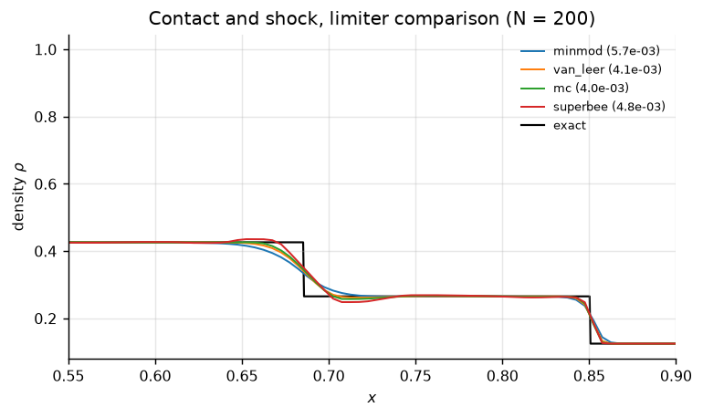
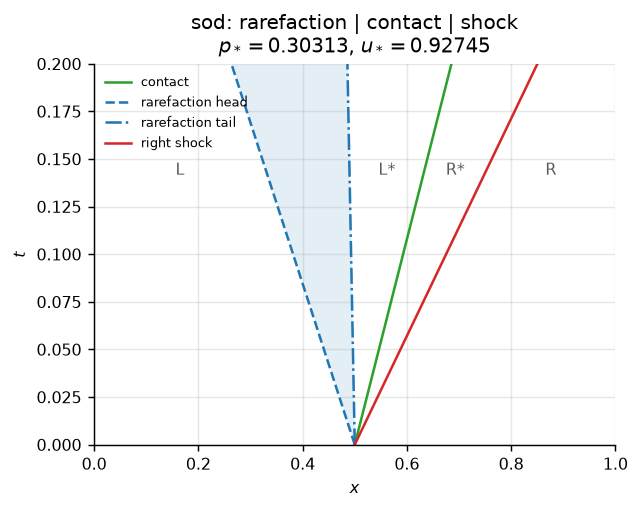
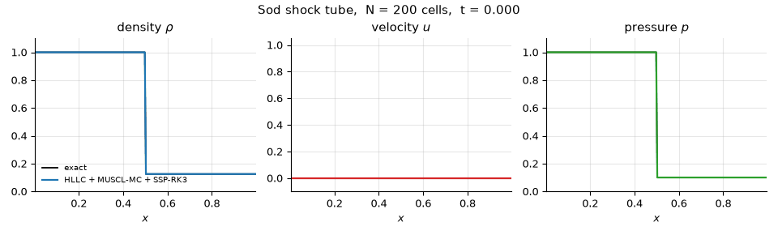

# Results

> Generated by `python scripts/generate_results.py`. Every number below is reproducible from a clean checkout.

## 1. Accuracy on Sod's shock tube

Sod shock tube, N = 200, CFL = 0.4, t = 0.2.

| scheme | L1 error (rho) | L1 error (u) | L1 error (p) | steps | error vs. Lax-Friedrichs |
|---|---:|---:|---:|---:|---:|
| Lax-Friedrichs | 3.274e-02 | 6.890e-02 | 3.406e-02 | 203 | 1.0x smaller |
| Local Lax-Friedrichs | 1.696e-02 | 2.628e-02 | 1.382e-02 | 213 | 1.9x smaller |
| 2nd order in space (MUSCL-minmod) | 4.446e-03 | 6.989e-03 | 3.043e-03 | 219 | 7.4x smaller |
| 2nd order in time (Heun) | 1.826e-02 | 3.076e-02 | 1.536e-02 | 212 | 1.8x smaller |
| 2nd order in space and time | 5.678e-03 | 9.497e-03 | 4.183e-03 | 217 | 5.8x smaller |
| HLLC + MUSCL-MC + SSP-RK3 **(best)** | 3.080e-03 | 5.454e-03 | 2.359e-03 | 219 | 10.6x smaller |

## 2. Verified order of accuracy

Discontinuous data cap every scheme at first order in $L^1$, so the design
order is measured on a smooth, exactly-advected density wave instead.

**Lax-Friedrichs**

| N | L1 error | observed order |
|---:|---:|---:|
| 25 | 2.849e-01 | — |
| 50 | 2.197e-01 | 0.37 |
| 100 | 1.441e-01 | 0.61 |
| 200 | 8.477e-02 | 0.77 |
| 400 | 4.641e-02 | 0.87 |
| 800 | 2.436e-02 | 0.93 |

**Local Lax-Friedrichs**

| N | L1 error | observed order |
|---:|---:|---:|
| 25 | 1.770e-01 | — |
| 50 | 1.062e-01 | 0.74 |
| 100 | 5.858e-02 | 0.86 |
| 200 | 3.078e-02 | 0.93 |
| 400 | 1.577e-02 | 0.96 |
| 800 | 7.982e-03 | 0.98 |

**2nd order in space and time**

| N | L1 error | observed order |
|---:|---:|---:|
| 25 | 3.931e-02 | — |
| 50 | 1.740e-02 | 1.18 |
| 100 | 5.014e-03 | 1.80 |
| 200 | 1.389e-03 | 1.85 |
| 400 | 3.790e-04 | 1.87 |
| 800 | 1.012e-04 | 1.90 |

**HLLC + MUSCL-MC + SSP-RK3**

| N | L1 error | observed order |
|---:|---:|---:|
| 25 | 9.204e-03 | — |
| 50 | 2.679e-03 | 1.78 |
| 100 | 6.828e-04 | 1.97 |
| 200 | 1.748e-04 | 1.97 |
| 400 | 4.342e-05 | 2.01 |
| 800 | 1.087e-05 | 2.00 |

## 3. Robustness across Toro's test suite

## 4. Effect of the slope limiter

| limiter | L1 error (ρ) |
|---|---:|
| minmod | 5.678e-03 |
| van_leer | 4.103e-03 |
| mc | 4.035e-03 |
| superbee | 4.819e-03 |

## 5. Exact wave structure

## 6. Time evolution

Produced separately by `python scripts/make_animation.py`, which asks the
solver for snapshots at evenly spaced times so every frame is a state the
scheme actually computed.

